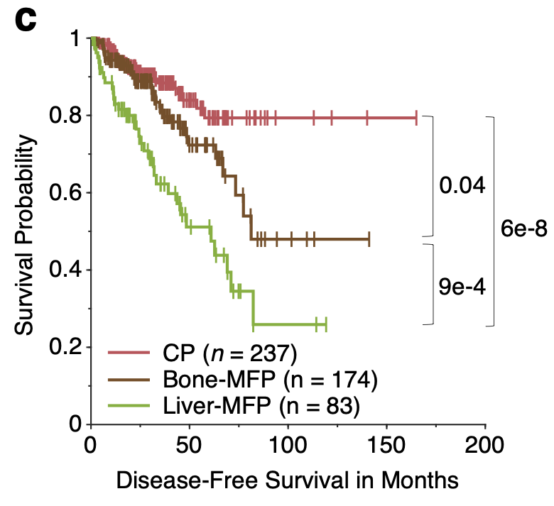

# METANET-analysis
## Introduction

MetaNet (Metastasis Network model), is a computational framework developed (1) to assess metastatic risk of a primary tumor, and (2) to stratify patients into risk groups with different propensities of organotropic metastases.

## How to Cite

The preprint of MetaNet manuscript is available at Research Square [link to the preprint](https://www.researchsquare.com/article/rs-73390/v1).

## Datasets

MetaNet is trained and tested by four large datasets:

* MSKCC-IMPACT (open access at [cBioPortal](https://www.cbioportal.org/study/summary?id=msk_impact_2017)),
* MET500 (PMID:[28783718](https://www.ncbi.nlm.nih.gov/pubmed/28783718)),
* FoundationONE (controled access at [dbGaP](https://www.ncbi.nlm.nih.gov/projects/gap/cgi-bin/study.cgi?study_id=phs001179.v1.p1)), and
* TCGA (open access at [FireHose Broad GDAC](https://gdac.broadinstitute.org/)).

Please access the data via the links, or follow the instruction to request the data if they are under control.

## Use Web Interface

For those "non-coding" people, the easest way to use MetaNet is to access the online version with user-friendly interface at https://wanglab.shinyapps.io/metanet

## Software Dependency

MetaNet depends on the following packages:

* [XGBoost](https://github.com/dmlc/xgboost)
* [ORCA](https://github.com/ayrna/orca)
* [MatSurv](https://github.com/aebergl/MatSurv)

Please follow the links to install the dependent software. It normally takes minutes to complete the installation. MetaNet was developed and tested in MacOS (v10.15.7) with 16 GB memory.

## Demo

MetaNet has two functional modules: Metastatic Risk Assessment (Figure 2 and 3) and Organotropic Stratification (Figure 6).

### Metastatic Risk Assessment

This module was developed in R (v3.6.3). It includes two parts: training by `metanet_model1_metastatic_risk_assessment_training.R` and inference by `metanet_model1_metastatic_risk_assessment_inference.R`.

To re-train the model by running the training code, it takes relatively long time to train a robust model with good parameter combination. For convenience, we provide the trained model file `xgb.model` and users can directly load the model to perform metastatic risk assessment and calculate the SHAP value to quantify the contribution of each genomic feature using the inference code:

```R
library(xgboost)

# Load the model: Make sure the model file is in the working directory
xgbmodel <- xgb.load('xgb.model')

# Load the demo data: Read a small example cohort of 10 samples from MSKCC
X <- as.matrix(read.delim('input_X.txt',na.strings = c("NaN"),
                          fill = TRUE,row.names = 1))

# Predict metastatic risk for each sample
mrisk <- predict(xgbmodel, xgb.DMatrix(X, missing = NA))
mrisk <- as.data.frame(mrisk)
rownames(mrisk) <- rownames(X)
head(mrisk)

# Calculate SHAP value for each feature in each sample
shap_contrib <- predict(xgbmodel,xgb.DMatrix(X, missing = NA),
                        predcontrib = TRUE,approxcontrib = FALSE)
shap_contrib <- as.data.frame(shap_contrib)
rownames(shap_contrib) <- rownames(X)
head(shap_contrib)
```

### Organotropic Stratification
This module was developed in Matlab 2017b. The higher version should work well. The entire module is implemented in the Matlab code `metanet_model2_organotropic_stratification.m`. For convenience to perform survival analysis, we provide a compile-free Matlab function `MatSurv.m` in this repository, which was developed by [Anders Berglund](https://github.com/aebergl).

Launch Matlab and hit `Run` button at the `EDITOR` panel, you will be able to load the processed data `input.mat`, train the model, and visualize the result by reproducing the stratification of TCGA prostate cancer cohort (Figure 6c). Typically, it takes a couple seconds to run this module.

<center></center>

## Contact

For any questions, please contact Professor Jiguang Wang via email: jgwang AT ust DOT hk

